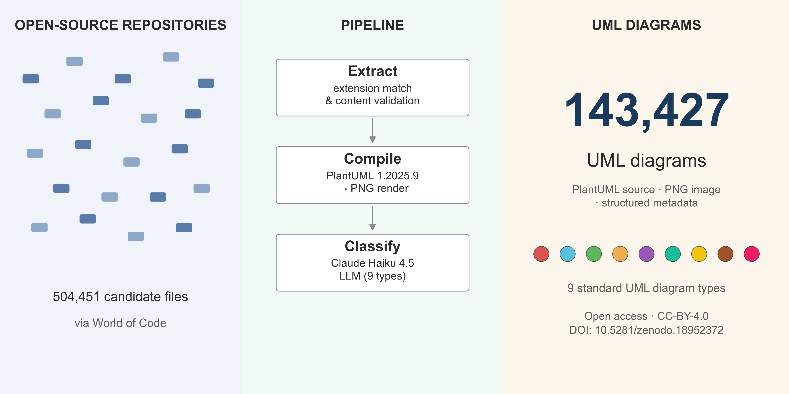

# UML-in-the-Wild

**A Large-Scale Dataset of UML Diagrams in PlantUML Notation from Open-Source Repositories**



[](https://doi.org/10.5281/zenodo.18952372)
[](https://creativecommons.org/licenses/by/4.0/)

## Overview

UML-in-the-Wild is a dataset of **143,427 UML diagrams** extracted from open-source repositories via the [World of Code](https://worldofcode.org/) (WoC) infrastructure. Each diagram is provided as both PlantUML source code and a rendered PNG image, accompanied by metadata including diagram type, structural element and connection counts, and source repository attribution.

**Download the dataset**: [Zenodo (DOI: 10.5281/zenodo.18952372)](https://doi.org/10.5281/zenodo.18952372)

This repository contains the extraction pipeline, classification scripts, and methodology documentation used to construct the dataset. For the accompanying data descriptor paper [TBD].

## Dataset Summary

| Metric | Value |
|--------|-------|
| Total diagrams | 143,427 |
| Diagram types | 9 (of 14 UML 2.5 types) |
| Format | PlantUML source (.puml) + rendered PNG |
| Total size | ~5.3 GB (625 MB sources, 4.6 GB images, 116 MB metadata) |
| Source | World of Code version V (March–May 2023 snapshot) |
| License | CC-BY-4.0 |

### Type Distribution

| Type | Count | % |
|------|------:|--:|
| Class | 73,958 | 51.6 |
| Sequence | 35,233 | 24.6 |
| Activity | 9,794 | 6.8 |
| Component | 8,204 | 5.7 |
| Use case | 7,172 | 5.0 |
| State | 4,343 | 3.0 |
| Object | 2,456 | 1.7 |
| Deployment | 2,078 | 1.4 |
| Timing | 189 | 0.1 |

## Pipeline Overview

```
Phase 1: Data Extraction (WoC server)
  Extension-based search across 128 basemap shards
  Content validation (@startuml/@enduml markers)

Phase 2: Preprocessing & Compilation (local)
  Multi-diagram splitting
  Tag normalization
  PlantUML v1.2025.9 compilation

Phase 3: Classification & Analysis (local)
  LLM classification (Claude Haiku 4.5), 9 UML types
  Non-UML filtering
  Element/connection extraction
```

## Repository Structure

```
phase1/                              # Data extraction from WoC
  1.extract_by_extension/            #   Parallel grep across basemap shards
  2.extract_by_content/              #   Content validation via python-woc
  stats/                             #   Per-extension validation rate analysis

phase2/                              # Preprocessing and image generation
  1.generate_puml_files/             #   Base64 decode → individual .puml files
  2.split_diagrams/                  #   Split multi-diagram files
  3.normalize_diagrams/              #   Strip custom @startuml names
  4.generate_images/                 #   PlantUML compilation to PNG

phase3/                              # Classification, analysis, validation
  1.classify_with_llm/               #   Claude Haiku 4.5 via Batch API
  2.count_lines/                     #   Content/comment line counts
  3.count_connections_and_elements/  #   Join element/connection stats
  4.cleanup/                         #   Filter non-UML, DOT, empty diagrams
  5.aggregate_stats/                 #   Recompute aggregate statistics
  manual_validation/                 #   Stratified sampling for expert review
  auto_validation/                   #   LLM vs parser cross-validation
  visualizations/                    #   Publication figures
  common/                            #   Shared preprocessing utilities

methodology/                         # Methodology documentation
  pipeline_methodology.md            #   Full pipeline description
  classification_methodology.md      #   LLM vs parser validation
  counting_methodology.md            #   DiagramStatsExtractor tool
  validation_methodology.md          #   Manual validation design
  element_type_keys.md               #   All 57 element type keys
  connection_type_keys.md            #   All 28 connection type keys

```

Each phase subdirectory contains its own README with detailed instructions.

## Prerequisites

### Phase 1: Data Extraction
- Access to WoC da0–da8 servers, visit WoC for access details
- [`python-woc`](https://github.com/ssc-oscar/python-woc) for blob retrieval
- Access to `/da8_data/basemaps/gz/` (lb2fFull basemaps)

### Phase 2: Preprocessing & Compilation
- Java 11+
- PlantUML 1.2025.9 JAR (bundled in `phase2/4.generate_images/`)

### Phase 3: Classification & Analysis
- Python 3.10+
- [Anthropic API](https://docs.anthropic.com/) key (for LLM classification)
- `matplotlib` (for figure generation)

### Element/Connection Extraction
- [PlantUML fork with DiagramStatsExtractor](https://github.com/vovanrew/plantuml) ([DOI: 10.5281/zenodo.19288003](https://doi.org/10.5281/zenodo.19288003))
- A custom Java class embedded in the PlantUML source tree that extracts per-diagram structural element and connection counts using PlantUML's own parsing pipeline

## Reproducing the Pipeline

The phases run sequentially, with each phase consuming the previous phase's output:

1. **Phase 1** runs on WoC servers. Output: `valid_plantuml_content.gz` (blob_id;path;base64)
2. **Phase 2** runs locally. Execute steps 1–4 in order to produce `.puml` files and `.png` images
3. **Phase 3** runs locally. Execute steps 1–6 in order to produce the final classified dataset

Phase 1 requires WoC server access; see the [WoC tutorial](https://github.com/woc-hack/tutorial) for details on obtaining access.

See the README in each phase subdirectory for step-by-step instructions.

## Citation

If you use this dataset, please cite:

### Dataset
```bibtex
@dataset{uml_in_the_wild_2026,
  author    = {Polischuk, Volodymyr},
  title     = {{UML-in-the-Wild: A Dataset of UML Diagrams in PlantUML
               Notation from Open-Source Repositories}},
  year      = {2026},
  publisher = {Zenodo},
  doi       = {10.5281/zenodo.18952372},
  url       = {https://doi.org/10.5281/zenodo.18952372}
}
```

### Extraction Tool
```bibtex
@software{plantuml_stats_extractor_2026,
  author    = {Polischuk, Volodymyr},
  title     = {{PlantUML 1.2025.9 with DiagramStatsExtractor}},
  year      = {2026},
  publisher = {Zenodo},
  doi       = {10.5281/zenodo.19288003},
  url       = {https://doi.org/10.5281/zenodo.19288003}
}
```

### Paper
```bibtex
% Data descriptor paper — to be updated after publication
```

## License

This repository is licensed under the [Creative Commons Attribution 4.0 International License (CC-BY-4.0)](https://creativecommons.org/licenses/by/4.0/).

Individual PlantUML source files in the dataset remain under their original repository licenses. The `repository` and `original_path` metadata fields enable users to locate the source repository and verify its license.

## Acknowledgments

- **[World of Code](https://worldofcode.org/)** project, University of Tennessee, Knoxville — data source infrastructure
- **[PlantUML](https://plantuml.com/)** (version 1.2025.9) — diagram compilation
- **[Anthropic Claude Haiku 4.5](https://www.anthropic.com/)** — diagram type classification
