# PlantUML Content Extraction Guide

This guide explains how to extract and validate PlantUML content from the World of Code (WoC) dataset.

## Overview

The extraction process consists of three main steps:

1. **Extract blob IDs** (on WoC server) - Already completed
2. **Extract content** (on WoC server) - Main extraction script
3. **Decode locally** (on your machine) - Convert base64 to files

## Prerequisites

### On WoC Server (da0)

- Python 3.8+
- `python-woc` library (already cloned in this directory)
- Access to WoC data at `/da*_data/` and `/da*_fast/`
- Input file: `/data/play/vopolva/plantuml_extraction/unique_plantuml_blobs_with_files.gz`

### On Local Machine

- Python 3.8+
- Downloaded `valid_plantuml_content.gz` file

## Step-by-Step Instructions

### Step 1: Verify Setup (On Server)

First, test that everything works with a small sample:

```bash
# SSH to da0 server
ssh da0

# Navigate to project directory
cd /path/to/plantuml-in-wild-dataset

# Run test script
python3 test_extraction.py
```

**Expected output:**
```
✓ Successfully imported WocMapsLocal
✓ WocMapsLocal initialized successfully
✓ Read 5 sample lines from input file
✓ All tests passed! Ready to run full extraction.
```

If you see errors, check:
- Is python-woc installed? `cd python-woc && python3 -m poetry install`
- Is the input file accessible? Check path in test script
- Is WoC profile available? Check `/home/wocprofile.json` or `/etc/wocprofile.json`

### Step 2: Run Full Extraction (On Server)

Run the main extraction script. This will process all 367,550 blobs.

**Basic usage:**
```bash
python3 extract_plantuml_content.py
```

**With custom settings:**
```bash
# Use 16 workers with verbose output
python3 extract_plantuml_content.py -w 16 -v

# Custom input/output paths
python3 extract_plantuml_content.py \
    -i /custom/path/unique_plantuml_blobs_with_files.gz \
    -o /custom/output/directory \
    -w 16
```

**Command-line options:**
- `-i, --input` - Input file path (default: `/data/play/vopolva/plantuml_extraction/unique_plantuml_blobs_with_files.gz`)
- `-o, --output-dir` - Output directory (default: `/data/play/vopolva/plantuml_extraction/`)
- `-w, --workers` - Number of parallel workers (default: half of CPU cores)
- `-v, --verbose` - Enable detailed logging

**Expected runtime:** 2-4 minutes with 16 workers

**Expected output files:**
```
/data/play/vopolva/plantuml_extraction/
├── valid_plantuml_content.gz      # Main output: blob_id;file_path;base64_content
├── plantuml_stats.json            # Statistics and timing
├── invalid_blobs.txt              # Blobs without @startuml/@enduml markers
└── error_blobs.txt                # Blobs that failed to load
```

### Step 3: Download Files (From Server to Local)

Download the extraction results to your local machine:

```bash
# On your local machine
scp da0:/data/play/vopolva/plantuml_extraction/valid_plantuml_content.gz .
scp da0:/data/play/vopolva/plantuml_extraction/plantuml_stats.json .
```

**Expected file size:**
- `valid_plantuml_content.gz`: ~40-60 MB (depending on valid count)
- `plantuml_stats.json`: <1 KB

### Step 4: Decode Content (On Local Machine)

Convert the base64-encoded content to individual PlantUML files:

**Option A: Individual .puml files**
```bash
# Decode to individual files
python3 decode_plantuml_content.py valid_plantuml_content.gz -o plantuml_files/

# This creates:
# plantuml_files/
# ├── 00000fade04e8301f0074863dd2a862606f2def7.puml
# ├── 000084f52fe6f2bcfc22549e167682d84ac2a9dc.puml
# └── ... (one file per blob)
```

**Option B: Single JSON file**
```bash
# Decode to JSON
python3 decode_plantuml_content.py valid_plantuml_content.gz -o plantuml_data/ -f json

# This creates:
# plantuml_data/plantuml_content.json
```

**Command-line options:**
- `input` - Input file (valid_plantuml_content.gz)
- `-o, --output` - Output directory (default: `plantuml_files/`)
- `-f, --format` - Output format: `files` or `json` (default: `files`)
- `-v, --verbose` - Enable detailed logging

## Output Formats

### Main Output File: `valid_plantuml_content.gz`

Format: One line per valid PlantUML blob
```
blob_id;file_path;base64_content
```

Example:
```
00000fade04e8301f0074863dd2a862606f2def7;/docs/frames/web.uml;QHN0YXJ0dW1sCmNsYXNzIFVzZXIKQGVuZHVtbA==
```

### Statistics File: `plantuml_stats.json`

```json
{
  "total_blobs": 367550,
  "valid_blobs": 250000,
  "invalid_blobs": 100000,
  "error_blobs": 17550,
  "duration_seconds": 180.5,
  "duration_minutes": 3.0,
  "blobs_per_second": 2036.3,
  "workers": 16,
  "timestamp": "2025-10-17 14:30:00"
}
```

### Decoded PlantUML Files

Each `.puml` file includes metadata as comments:

```plantuml
' Blob ID: 00000fade04e8301f0074863dd2a862606f2def7
' File Path: /docs/frames/web.uml
'
@startuml
class User {
  +String name
  +String email
}
@enduml
```



## Troubleshooting

### "Could not import python-woc"

**Solution:**
```bash
cd python-woc
python3 -m pip install poetry
python3 -m poetry install
```

### "No module named 'tqdm'"

**Solution:**
```bash
pip3 install tqdm
```

Note: tqdm is optional. The script will work without it, but won't show a progress bar.

### "No such file or directory: wocprofile.json"

**Solution:**
The WoC profile should be at `/home/wocprofile.json` or `/etc/wocprofile.json` on UTK servers.

If not, you need to generate one:
```bash
cd python-woc
python3 -m woc.detect /da0_data /da3_fast /da4_data /da5_fast > wocprofile.json
export WOC_PROFILE=./wocprofile.json
```

### Extraction is very slow

**Possible causes:**
- Too few workers: Increase with `-w` flag (try 16-32)
- I/O bottleneck: Check disk usage with `iostat -x 1`
- Network issues: Make sure you're running on the WoC server, not via SSH with file mounts

**Optimization:**
```bash
# Use more workers if you have available cores
python3 extract_plantuml_content.py -w 32
```

### Some blobs return errors

This is normal! Some blobs may be:
- Deleted or moved in WoC
- Corrupted data
- Not actually PlantUML despite the file extension

Check `error_blobs.txt` for details on which blobs failed and why.

## Next Steps

After extraction, you can:

1. **Analyze PlantUML content** - Study diagram types, patterns, complexity
2. **Map to projects** - Use blob IDs to join with WoC project data
3. **Extract metrics** - Count classes, relationships, diagram types
4. **Train models** - Use as dataset for ML/AI research

## Additional Resources

- [World of Code Documentation](https://github.com/woc-hack/tutorial)
- [python-woc Repository](https://github.com/ssc-oscar/python-woc)
- [PlantUML Documentation](https://plantuml.com/)

## Support

If you encounter issues:

1. Check this troubleshooting guide
2. Review the log output carefully
3. Run the test script first (`test_extraction.py`)
4. Check WoC server status and disk space
