# Generate PUML Files from Base64

Decodes base64-encoded PlantUML content and creates individual `.puml` files on disk.

## Input

A text file (plain or gzipped) where each line has the format:

```
blob_id;file_path;base64_content
```

- `blob_id` — 40-character SHA-1 hex hash (WoC blob identifier)
- `file_path` — original file path in the source repository
- `base64_content` — Base64-encoded PlantUML source code

This file is produced by the Phase 1 extraction pipeline (`valid_plantuml_content.gz`) or the length filter (`plantuml_content.txt`).

## Usage

```bash
# Basic usage (required argument)
python3 generate_puml_from_base64.py /path/to/plantuml_content.txt

# Custom output directory
python3 generate_puml_from_base64.py input.txt -o ./my_output

# Enable batching into subdirectories
python3 generate_puml_from_base64.py input.txt --batch

# Enable batching with custom batch size
python3 generate_puml_from_base64.py input.txt --batch -b 5000

# Dry run (parse and validate without writing files)
python3 generate_puml_from_base64.py input.txt --dry-run

# Verbose logging
python3 generate_puml_from_base64.py input.txt -v
```

## Options

| Flag | Description | Default |
|------|-------------|---------|
| `input` (positional) | Input file path | *(required)* |
| `-o, --output-dir` | Output directory for `.puml` files | `./puml` |
| `-m, --metadata-file` | Metadata JSON output path | `./metadata/blob_metadata.json` |
| `--batch` | Split output into batch subdirectories | off |
| `-b, --batch-size` | Files per batch subdirectory (requires `--batch`) | `10000` |
| `--dry-run` | Parse without writing files | off |
| `-v, --verbose` | Enable debug logging | off |

## Output

### PUML files

Each blob produces a file named `{blob_id}.puml` with metadata comments prepended:

```plantuml
' Blob ID: 00000fade04e8301f0074863dd2a862606f2def7
' Original Path: /docs/frames/web.uml
' Source: World of Code

@startuml
class User {
  +String name
}
@enduml
```



By default, all files are written to a single output directory. With `--batch`, files are organized into subdirectories (`batch_0001/`, `batch_0002/`, ...) with `--batch-size` files each.

### Metadata

`blob_metadata.json` maps each blob ID to its original path and output location:

```json
{
  "00000fade04e8301f0074863dd2a862606f2def7": {
    "file_path": "/docs/frames/web.uml",
    "batch": 1,
    "puml_file": "puml/batch_0001/00000fade04e8301f0074863dd2a862606f2def7.puml"
  }
}
```

## Validation

The script performs these checks on each entry:
- Blob ID is a valid 40-character hex string
- Base64 content decodes successfully
- Decoded content contains both `@startuml` and `@enduml` markers

Entries that fail validation are counted and the first 100 errors are reported in the summary.
