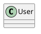

# Normalize @startuml Directives

Removes custom names from `@startuml` tags to ensure PNG output filenames match source file names.

## Problem

PlantUML allows custom names in `@startuml` tags:



When compiled, PlantUML uses the custom name as the output filename (`MyDiagram.png`) instead of the source filename. Since the pipeline relies on blob-ID-based naming (`{blob_id}.puml` → `{blob_id}.png`), custom names break the mapping between source files and generated images.

## What It Does

Strips custom names from `@startuml` directives:

| Before | After |
|--------|-------|
| `@startuml MyDiagram` | `@startuml` |
| `@startuml{my-diagram}` | `@startuml` |
| `@startuml some name here` | `@startuml` |

Valid PlantUML parameters are **preserved**:

| Kept unchanged |
|----------------|
| `@startuml(id=DC01)` |
| `@startuml[scale=2]` |

## Usage

```bash
# Process a directory of .puml files
./normalize_startuml.sh /path/to/puml
```

The script auto-detects whether the directory contains `batch_*` subdirectories or flat `.puml` files.

## Arguments

| Argument | Description | Default |
|----------|-------------|---------|
| `puml_directory` (positional) | Directory containing `.puml` files | `./puml` |
